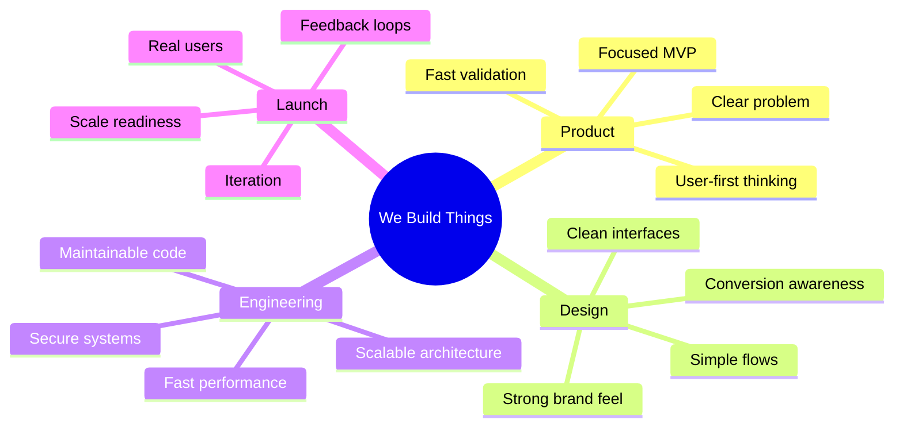

  

<h1 align="center">We Build Things</h1>

  <strong>Designing, building, and launching digital products for founders, startups, and ambitious teams.</strong>

  From idea to interface, from prototype to production, from launch to scale.

  <a href="https://webuildthings.in/">Website</a>
  ·
  <a href="https://cal.com/vivek-gandharla-launchlayer/quick-chat">Book a Call</a>
  ·
  <a href="#what-we-build">What We Build</a>
  ·
  <a href="#our-engineering-system">Engineering</a>
  ·
  <a href="#how-we-work">Process</a>

  
  
  
  
  

---

## We turn ideas into products people can actually use.

We Build Things is a product development studio for founders and teams who want to move fast without building messy software.

We help shape raw ideas into usable products through strategy, design, development, automation, and launch support.

Our work sits at the intersection of:

<table>
  <tr>
    <td><strong>Product Thinking</strong></td>
    <td>Understanding the problem, user, market, and product direction.</td>
  </tr>
  <tr>
    <td><strong>Design Execution</strong></td>
    <td>Creating clean interfaces, user journeys, design systems, and brand experiences.</td>
  </tr>
  <tr>
    <td><strong>Engineering Depth</strong></td>
    <td>Building scalable frontends, backends, APIs, dashboards, automations, and production-ready systems.</td>
  </tr>
  <tr>
    <td><strong>Launch Focus</strong></td>
    <td>Shipping fast, collecting feedback, improving the product, and preparing it for growth.</td>
  </tr>
</table>

We do not just make websites look good.

We build digital products that are designed to perform.

---

## What We Build

  <strong>From raw idea to shipped product — we cover the full product lifecycle.</strong>

<table>
  <tr>
    <td width="33%" valign="top">
      <h3>🚀 MVP Development</h3>
      
Focused first versions built to validate ideas fast.

      

        
      

    </td>
    <td width="33%" valign="top">
      <h3>🌐 Web Applications</h3>
      
Modern full-stack products for startups and businesses.

      

        
        
      

    </td>
    <td width="33%" valign="top">
      <h3>📱 Mobile Applications</h3>
      
Mobile-first apps for iOS, Android, and hybrid product launches.

      

        
        
      

    </td>
  </tr>

  <tr>
    <td width="33%" valign="top">
      <h3>🤖 AI Automation</h3>
      
AI-powered workflows, assistants, agents, and internal tools.

      

        
        
      

    </td>
    <td width="33%" valign="top">
      <h3>🎨 UI/UX Design</h3>
      
Clean interfaces, user flows, prototypes, and design systems.

      

        
        
      

    </td>
    <td width="33%" valign="top">
      <h3>✨ Branding & Framer</h3>
      
Brand identity, landing pages, launch pages, and marketing sites.

      

        
        
      

    </td>
  </tr>
</table>

---

## Our Product Stack

We use the stack that fits the product, not the other way around.

  
  
  
  
  
  

---

## How We Work

Our process is built to reduce confusion and increase shipping speed.

---

 

  <strong>From rough idea to launch-ready product — with clarity, speed, and scalable execution.</strong>

<table>
  <tr>
    <td width="33%" valign="top" align="center">
      <h1>🔍</h1>
      <h3>01 · Discover</h3>
      
We clarify the idea, users, business goal, MVP scope, launch constraints, and technical roadmap.

      

        
        
      

    </td>
    <td width="33%" valign="top" align="center">
    <h1>⚡</h1>
      <h3>02 · Build</h3>
      
We design and build interfaces, frontend, backend, APIs, dashboards, automations, and integrations.

      

        
        
      

    </td>
   <td width="33%" valign="top" align="center">
    <h1>🚀</h1>
      <h3>03 · Launch</h3>
      
We deploy, test with real users, gather feedback, optimize performance, and prepare for scale.

      

        
        
      

    </td>
  </tr>
</table>

---

## Our Engineering System

<table>
  <tr>
    <td width="50%" valign="top">
      <h2>🧼</h2>
      <h3>Readable by Humans</h3>
      

        Clean structure, clear naming, and simple logic so teams can understand the codebase without fighting it.
      

      

        <code>clear_naming</code> · <code>simple_logic</code> · <code>clean_structure</code>
      

    </td>
    <td>
    <h2>🛠️</h2>
      <h3>Built to Maintain</h3>
      

        Reusable patterns and modular decisions that make features easier to debug, improve, and extend.
      

      

        <code>reusable_patterns</code> · <code>easy_debugging</code> · <code>smooth_handover</code>
      

    </td>
  </tr>

  <tr>
    <td width="50%" valign="top">
      <h2>📈</h2>
      <h3>Ready to Scale</h3>
      

        Architecture that supports new users, future features, integrations, and product growth without a painful rebuild.
      

      

        <code>modular_systems</code> · <code>growth_ready</code> · <code>flexible_architecture</code>
      

    </td>

   <td width="50%" valign="top">
      <h2>⚡</h2>
      <h3>Fast Where It Matters</h3>
      

        Performance-aware frontend, backend, and API choices that make products feel smooth in real usage.
      

      

        <code>fast_pages</code> · <code>optimized_apis</code> · <code>smooth_ux</code>
      

   </td>
  </tr>

  <tr>
    <td width="50%" valign="top">
      <h2>🔐</h2>
      <h3>Secure From Day One</h3>
      

        Authentication, permissions, API access, and data handling treated as core product concerns, not afterthoughts.
      

      

        <code>auth</code> · <code>access_control</code> · <code>safe_apis</code>
      

    </td>

   <td>
   <h2>🚀</h2>
      <h3>Built for Launch</h3>
      

        Products prepared for deployment, monitoring, real users, feedback loops, and future scale.
      

      

        <code>deployment</code> · <code>monitoring</code> · <code>real_users</code>
      

   </td>
  </tr>
</table>

## For Founders

  <strong>We help founders move from uncertainty to a clear, buildable product plan.</strong>

<table>
  <tr>
    <td width="50%" valign="top">
      <h3>🧭 Before Building</h3>
      

        Most early products fail because teams build too much before they understand what truly matters.
      

      

        We help define the right first version by cutting noise, clarifying the user problem, and shaping a focused MVP.
      

    </td>
     <td width="50%" valign="top">
      <h3>🚀 After Launch</h3>
      

        A product is not finished when it goes live.
      

      

        We help founders improve, measure, iterate, and prepare the product for real users, feedback, and scale.
      

    </td>
  </tr>
</table>

### Founder Questions We Help Answer

<table>
  <tr>
    <td width="25%" align="center" valign="top">
      <h2>01</h2>
      <h4>What should we build first?</h4>
      
MVP scope · Core features · Launch path

    </td>
    <td width="25%" align="center" valign="top">
      <h2>02</h2>
      <h4>What should we avoid?</h4>
      
Feature cuts · Complexity control · Faster validation

    </td>
    <td width="25%" align="center" valign="top">
      <h2>03</h2>
      <h4>How do we validate quickly?</h4>
      
Prototype · User feedback · Market signal

    </td>
    <td width="25%" align="center" valign="top">
      <h2>04</h2>
      <h4>What should the MVP include?</h4>
      
Must-have flows · User journey · Product logic

    </td>
  </tr>

  <tr>
    <td width="25%" align="center" valign="top">
      <h2>05</h2>
      <h4>What should it look like?</h4>
      
UI/UX · Brand feel · Product experience

    </td>
    <td width="25%" align="center" valign="top">
      <h2>06</h2>
      <h4>What stack should we use?</h4>
      
Frontend · Backend · Cloud · Automation

    </td>
    <td width="25%" align="center" valign="top">
      <h2>07</h2>
      <h4>How do we ship cleanly?</h4>
      
Execution plan · Build cycles · Launch readiness

    </td>
    <td width="25%" align="center" valign="top">
      <h2>08</h2>
      <h4>How do we scale later?</h4>
      
Architecture · Iteration · Future roadmap

    </td>
  </tr>
</table>

  

 

<blockquote align="center">
  <h3 >
    “We do not build bloated first versions.
     
    We build focused products that are ready to validate.”
  </h3>
</blockquote>

  
    Less noise. Clearer scope. Faster launch. Better learning.
  

 

---

## For Teams

  <strong>
    Already have a team? We help them move faster, ship cleaner, and build with more confidence.
  </strong>

  We plug into your existing workflow as a product, design, engineering, or automation partner — without disrupting how your team already works.

 

<table>
  <tr>
    <td width="50%" valign="top">
      <h3>🧩 We Extend Your Team</h3>
      

        Your team already has product context, business knowledge, and customer understanding.
        We add focused execution where extra speed, design depth, or engineering bandwidth is needed.
      

      

        
        
        
      

    </td>
    <td width="50%" valign="top">
      <h3>⚡ We Remove Execution Bottlenecks</h3>
      

        When roadmaps slow down because of pending designs, frontend work, backend APIs,
        cleanup tasks, automations, or launch preparation, we help push things forward.
      

      

        
        
        
      

    </td>
  </tr>
</table>

 

<table>
  <tr>
    <td width="33%" align="center" valign="top">
      <h2>🎨</h2>
      <h3>Product & Design</h3>
      

        Product flows, UI/UX, design systems, prototypes, and interface improvements.
      

      

        <code>product_design</code> 
        <code>ui_ux</code> 
        <code>design_systems</code>
      

    </td>
    <td width="33%" align="center" valign="top">
      <h2>⚙️</h2>
      <h3>Engineering</h3>
      

        Frontend, backend, APIs, technical cleanup, feature development, and product iteration.
      

      

        <code>frontend</code> 
        <code>backend</code> 
        <code>feature_builds</code>
      

    </td>
    <td width="33%" align="center" valign="top">
      <h2>🤖</h2>
      <h3>Automation & Tools</h3>
      

        AI automation, internal tools, dashboards, workflows, and operational systems.
      

      

        <code>ai_automation</code> 
        <code>internal_tools</code> 
        <code>dashboards</code>
      

    </td>
  </tr>
</table>

 

  
  
  

<blockquote align="center">
  <h3 >
     “We do not replace your team.
     
    We strengthen the parts of the product that need more momentum.”
  </h3>
</blockquote>
 

---

## Our Build Principles

---

## Work With Us

If you are building a product, MVP, AI workflow, web app, mobile app, internal tool, or landing page, we can help you take it from idea to launch.

  
  

---

  <strong>Build. Launch. Scale.</strong>

  We Build Things that move ideas forward.

